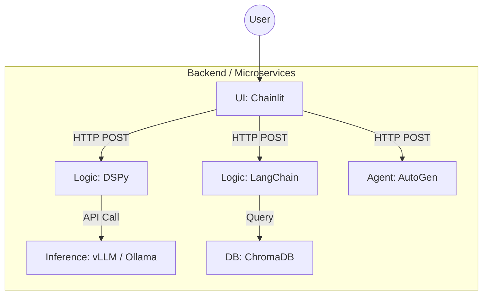

# LLM_PoC

大規模言語モデル（LLM）周辺の最先端技術、フレームワーク、データベース、運用ツールを学習・実験するための包括的なリポジトリです。

## 🛠 開発環境・前提

- **OS:** Ubuntu (WSL2 on Windows 11)
- **Container:** Docker / Docker Compose
- **Orchestration (Goal):** Kubernetes (K8s)
- **Primary Language:** Python
---

## 🏗 アーキテクチャ設計思想: "Microservices & API-First"

本リポジトリでは、LLM周辺技術特有の「激しい依存関係の競合（Dependency Hell）」を回避し、将来的なKubernetes環境への移行を見据え、**マイクロサービスアーキテクチャ** を採用しています。

### 設計のポイント

1.  **完全な環境分離 (Isolation)**
    * 各ディレクトリ（技術コンポーネント）ごとに独立した `Dockerfile` と `requirements.txt` を持ちます。
    * 例: `vllm` (PyTorch 2.1) と `unsloth` (PyTorch 2.2) が同一リポジトリ内で共存可能です。

2.  **APIによる疎結合連携**
    * 各コンポーネントは **FastAPI** 等を用いて Web API サーバーとして稼働させます。
    * コンポーネント間の連携は、ライブラリの `import` ではなく、HTTP通信（REST API）によって行います。

3.  **UI/Gateway**
    * **Chainlit** を全体のオーケストレーター（UI層）として配置し、各マイクロサービスAPIを呼び出して統合的なアプリケーションとして振る舞わせます。

### 構成イメージ

---

## 📂 技術スタック & ディレクトリ構成

### 1. UI & Orchestration
* **`Chainlit/`**: チャットUIおよびアプリケーションの統合・制御ハブ(Chainlitのコード（UI）の中に、AIのロジックを組み込むことはダメ。AI部分はAPIとして独立させたい。)。 1
* **`docker-compose.yml`**: ローカル開発用のコンテナ一括起動設定。 2
* **`k8s-manifests/`**: Kubernetesデプロイ用のマニフェストファイル置き場。(今は必要ない。Docker Composeで十分。) 4

### 2. Logic & Agent (脳・思考)
* **`dspy/`**: プロンプト自動最適化フレームワーク。1
* **`langchain/`**: LLMアプリ開発の標準フレームワーク。1
* **`langgraph/`**: グラフ構造によるステートフルなエージェント構築。2
* **`autogen/`**: マルチエージェント（複数のAIによる協調作業）システム。3
* **`llamaindex/`**: RAG（検索拡張生成）に特化したデータ接続フレームワーク。3
* **`mcp/`**: Model Context Protocol (TypeScript推奨)。AIエージェントにツールやコンテキストを提供する標準規格。3

### 3. Inference & Model Serving (推論・API)
* **`vllm/`**: 高スループット・低遅延なLLM推論エンジン。2
* **`sglang/`**: 構造化出力や複雑なプロンプトに強い高速推論エンジン。2
* **`ollama/`**: ローカルLLMを簡単に実行・管理するツール。2
* **`litellm/`**: 複数のLLM API（OpenAI, Vertex, Ollama等）を統一インターフェースで扱うプロキシ。3
* **`google-genai/`**: Google Gemini APIを利用するための接続モジュール。1

### 4. Data, Embeddings & Database (記憶・抽出)
* **`chromadb/`**: ベクトルデータベース。1
* **`cozodb/`**: ベクトル検索とグラフ構造を扱うハイブリッドDB。1
* **`sentence-transformers-huggingface/`**: テキストをベクトル化するための埋め込みモデル実行環境。1
* **`gliner2/`**: あらゆるエンティティタイプに対応した高性能な固有表現抽出（NER）モデル。2
* **`unstructured/`**: 非構造化データ（PDF, HTML等）の前処理パイプライン。3
* **`distilabel/`**: 学習用データセットの生成・合成。3

### 5. Training & Fine-tuning (学習)
* **`unsloth/`**: 高速かつ省メモリなLoRA/QLoRAファインチューニング。2
* **`trl/`**: 強化学習（RLHF/DPO）によるモデルのアライメント調整。3
* **`transformers-huggingface/`**: Hugging Face Transformersを用いた標準的なモデル操作・学習の基礎実験。1

### 6. Reliability & Ops (信頼性・運用)
* **`instructor/`**: Pydanticを使用した堅牢な構造化出力（JSON）の保証。3
* **`outlines/`**: 正規表現等による生成テキストの厳密な制御。3
* **`ragas/`**: RAGパイプラインの精度評価（RAG Assessment）。3
* **`langfuse/`**: LLMアプリケーションのトレース・可観測性（Observability）。3

---

## 🚀 開発ワークフロー

各ディレクトリで開発を行う際は、以下の意識でコードを記述します。

1. **単体動作 (`__name__ == "__main__"`)**
* まずはDockerで、そのディレクトリ内で完結する環境を作る。
* 次に、そのディレクトリ内で完結するロジックを書きます。
* `python main.py` を実行するだけで、その機能単体の動作確認ができるようにします。

1. **API化 (FastAPI Wrapper)**
* ロジックが完成したら、FastAPI等でラップし、HTTP経由で入力を受け取り、結果を返すようにします。

3. **統合 (Chainlit)**
* ChainlitからAPIを呼び出し、実際のアプリ機能として組み込みます。

## 📅 Roadmap

* [ ] 各主要技術の Docker環境構築 (Pattern A)
* [ ] Chainlit との API連携実装
* [ ] Chainlit部分をJava(SpringBoot)で表現してみる
* [ ] Kubernetes (k8s-manifests) へのデプロイ練習